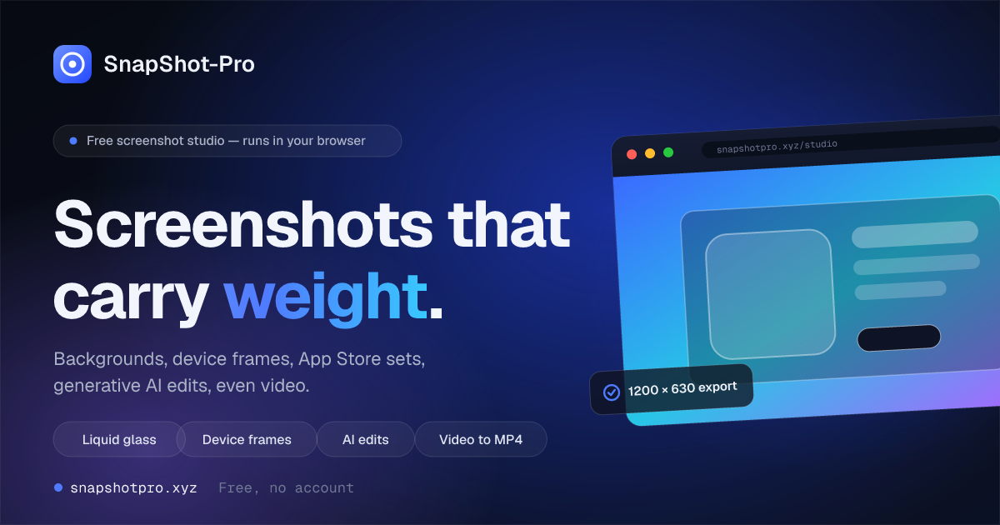

<p align="center">
  <a href="https://snapshotpro.xyz"></a>
</p>

<h1 align="center">SnapShotPro</h1>

<p align="center">
  The browser screenshot studio. Turn a raw screen grab into a polished, on-brand shot in seconds.
  <br>Free, open source, and private. No account, no install, nothing uploaded.
</p>

<p align="center">
  <a href="https://snapshotpro.xyz/editor/"><b>Open the studio →</b></a>
  &nbsp;·&nbsp;
  <a href="https://snapshotpro.xyz/tools/">Tools</a>
  &nbsp;·&nbsp;
  <a href="https://snapshotpro.xyz/features/">Features</a>
  &nbsp;·&nbsp;
  <a href="https://snapshotpro.xyz/changelog/">Changelog</a>
</p>

<p align="center">
  
  
  
  
</p>

---

## What it is

SnapShotPro is a full screenshot and mockup studio that runs entirely in your browser.
Drop in a screen, and it is already framed and padded. From there you can add device
mockups, backgrounds, annotations, color grading, motion, and AI, then export anywhere it
needs to go. Everything renders locally on your machine and bakes into the export, so what
you see is exactly what you download.

**[Open the studio →](https://snapshotpro.xyz/editor/)**

## Why people use it

- **Free and open source.** The whole studio is free, and the source is right here.
- **No account, no install.** Open a tab and start. Nothing is uploaded unless you choose a cloud feature.
- **Private by default.** Editing, background removal, and OCR all run on your device.
- **One canvas, every output.** Stills, social sizes, store sets, GIFs, and video all come from the same scene.
- **Installable PWA.** Works fully offline after the first load.

## Features

- **Device mockups** — iPhone, iPad, Pixel, MacBook, Apple Watch, Studio Display, plus browser and OS window frames. Flat, tilted, or real WebGL 3D you can orbit, light, and spin-export.
- **Backgrounds** — solid, gradient, mesh, pattern, image, or transparent.
- **Color engine** — filters, custom palettes with harmony generation, cinematic grades, duotone, and color mapping.
- **Effects** — drop shadows, reflections, perspective tilt, liquid glass, film grain, and spotlight.
- **Annotation and redaction** — arrows, shapes, numbered markers, text, and blur or pixelate to hide private data.
- **Text and brand** — rich text overlays, watermark, logo, and a reusable brand kit.
- **AI (optional)** — a design agent that composes a look from a sentence, background generation, subject isolation, OCR, vision, outpaint, and magic eraser.
- **Motion** — Ken Burns, per-element animation, a timeline, in-browser screen recording, and GIF or MP4 export.
- **Output** — PNG, JPEG, WebP, GIF, MP4, multi-page PDF decks, and ZIP for batches and App Store sets at every store size.
- **Projects** — save, version history, and optional cloud sync. A Cmd-K command palette ties it together.

See the full list at [snapshotpro.xyz/features](https://snapshotpro.xyz/features/).

## Develop

```bash
npm install
npm run dev      # dev server at http://localhost:5173
npm run build    # production build to dist/
npm run preview  # serve the built dist/
```

Vanilla JavaScript and Vite, no framework. The editor lives at `/editor/`; the marketing and
info pages are separate Vite inputs (see `rollupOptions.input` in `vite.config.js`). 3D mockups
use three.js, optional AI runs through Vercel serverless functions in `api/`, and cloud sync
is optional via Supabase. Architecture notes are in [`CLAUDE.md`](CLAUDE.md); deployment is in
[`DEPLOY.md`](DEPLOY.md).

## Contributing

Issues and pull requests are welcome. If you are adding a feature, a good place to start is the
`bind*` pattern in `src/features/` and the single `render()` pipeline described in `CLAUDE.md`.
Found a bug or have an idea? [Open an issue](https://github.com/I-794/SnapShotPro/issues).

## License

[MIT](LICENSE) © Charlie L.
